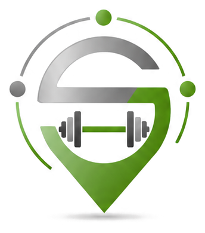
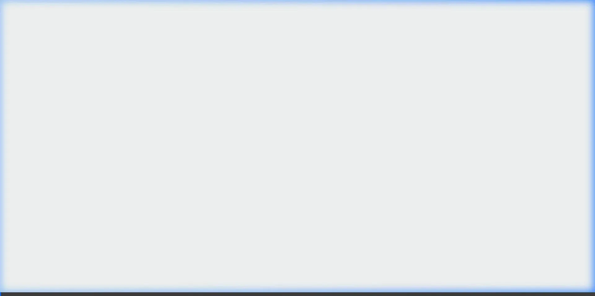
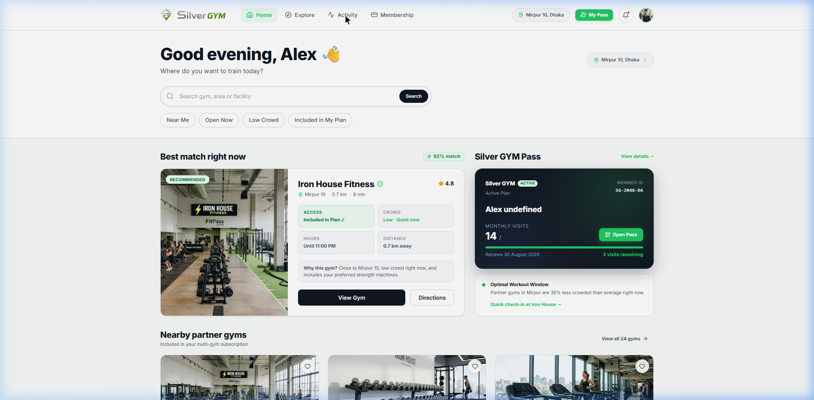
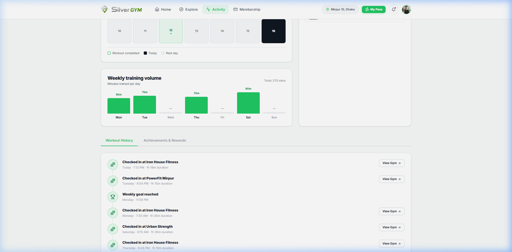

<div align="center">
  
  <h1>Silver GYM</h1>
  <p><strong>A modern multi-gym subscription platform. One pass, unlimited fitness.</strong></p>
</div>

<br />

## 🌟 Overview

Silver GYM is a full-stack platform that allows members to access multiple premium partner gyms using a single subscription plan. The application features a stunning, highly-polished user interface optimized for both desktop and mobile, with seamless check-in flows and real-time activity tracking.

<div align="center">
  
  <p><em>End-to-End Member Journey: Dashboard, Exploration, and Check-in</em></p>
</div>

---

## ✨ Features

- **Multi-Gym Access:** Browse, filter, and explore 150+ verified partner gyms included in your active plan.
- **Dynamic Check-in Flow:** QR-code-based digital pass and a beautifully animated check-in simulation.
- **Activity & Analytics:** Track your weekly workouts, streaks, and gym visits with visual charts.
- **Modern UI/UX:** Built with a custom design system, glassmorphism elements, CSS variables, and Lucide React icons.
- **Mock-to-API Ready:** Frontend architecture uses a decoupled Service/Repository layer, making it trivial to switch from local mock data to a real production backend.

### Member Dashboard


### Activity Tracking


---

## 🛠️ Tech Stack

- **Frontend:** React 18, React Router v6, Vite, Vanilla CSS (Custom Design System)
- **Icons & Assets:** Lucide React, SVG Icons
- **Architecture:** Context-free Hooks, Repository Pattern for Data Layer, LocalStorage caching
- **Backend:** Express.js (REST API setup ready for integration)

---

## 🚀 Getting Started

The project is split into `frontend` and `backend` directories. Currently, the frontend operates completely independently using a simulated data layer.

### 1. Install Dependencies
Ensure you have Node.js installed.
```bash
# Install frontend dependencies
cd frontend
npm install

# Install backend dependencies (optional for now)
cd ../backend
npm install
```

### 2. Run the Development Servers
Start the Vite development server for the frontend:
```bash
cd frontend
npm run dev
```
The app will be available at [http://localhost:5173](http://localhost:5173).

*(Optional)* Start the Express backend:
```bash
cd backend
npm run dev
```

---

## 📂 Folder Structure

```text
Silver-GYM/
├── frontend/                  # React Client Application
│   ├── public/                # Static assets (Favicons, etc.)
│   ├── src/
│   │   ├── assets/            # Images, SVGs, Brand assets
│   │   ├── components/        # Reusable UI components (Buttons, Cards, Modals)
│   │   ├── data/              # Storage adapters & Mock Repositories
│   │   ├── hooks/             # Custom domain hooks (useMembership, useActivity)
│   │   ├── layouts/           # Page wrapper layouts (MemberLayout, PublicLayout)
│   │   ├── pages/             # Route components (Home, Explore, Check-In, Auth)
│   │   ├── services/          # Business logic & API adapters
│   │   ├── App.jsx            # Routing configuration
│   │   └── index.css          # Global Design System & Variables
├── backend/                   # Express API Application
└── docs/                      # Documentation assets and screenshots
```

---

## 📄 License

This project is licensed under the MIT License.
